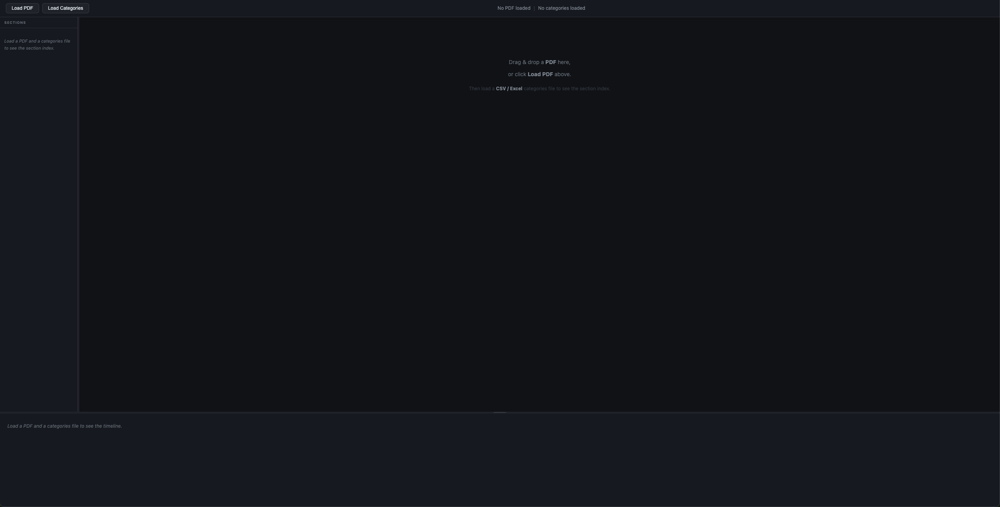

# PDF Timeline Viewer

Have you ever received a long PDF — a court case, a project file, a medical record — and struggled to find which pages belong to which topic? **PDF Timeline Viewer** solves that.

You provide a PDF and a simple spreadsheet that maps page numbers to categories. The app displays your PDF with a **colour-coded swimlane timeline** underneath it. Each row in the timeline is a category; coloured blocks show exactly which pages belong to it. Click any block to jump straight to that page.

- No installation required
- No internet connection needed after download
- Nothing leaves your computer — all processing happens in your browser

---

## Screenshots

**Homepage — initial state before loading any files**


**Homepage — after loading a PDF and categories file**


**Timeline View — swimlane overview of all categories across pages**


**Page Navigation — click any block or use arrow keys to jump to a page**


**CSV File Example — the categories file format**


---

## Who is this for?

- **Lawyers and paralegals** reviewing multi-document court bundles
- **Researchers** navigating long reports or archival records
- **Project managers** working through phased documentation
- **Anyone** who needs to quickly find and jump between sections in a large PDF

---

## Step 1 — Download the app

You do not need to install anything. Just download the files and open them in your browser.

**On GitHub:**

1. Click the green **Code** button near the top of this page
2. Click **Download ZIP**
3. Once downloaded, unzip the folder (double-click it on Mac or Windows)
4. Open the unzipped folder — you will see `index.html`, `app.js`, `style.css`, and others

---

## Step 2 — Open the app

**Double-click `index.html`** — this opens the app in your default browser.

> **If the PDF does not display after loading** (blank white area), your browser is blocking local file access. Use the local server method below instead — it takes under a minute.

**Local server method (fixes the blank PDF issue):**

If you have Python installed (it comes pre-installed on Mac):

```bash
# Open Terminal, navigate to the unzipped folder, then run:
python3 -m http.server 8765
```

Then open your browser and go to: `http://localhost:8765`

If you have Node.js installed:

```bash
npx serve .
```

---

## Step 3 — Try the sample files first

Before using your own PDF, try the included sample files to make sure everything is working.

1. Click **Load PDF** in the toolbar → select `sample/PDF2_Disputed_Inheritance_Court_Case.pdf`
2. Click **Load Categories** → select `sample/PDF2_Disputed_Inheritance_Court_Case.csv`
3. The swimlane timeline should appear immediately below the PDF

You should see 6 coloured rows (Land Records, Legal Heir Certificate, Revenue/Mutation, Court Filings, Forensic Evidence, Case Summary). Click any coloured block to jump to that page.

A second sample (`sample/sample.pdf` + `sample/sample.csv`) is a generic 60-page document with 6 sections — useful for testing page ranges.

---

## Step 4 — Use with your own PDF

### 4a. Open your PDF

Click **Load PDF** and select your `.pdf` file, or drag and drop it anywhere on the window.

### 4b. Create a categories file

You need a spreadsheet (CSV or Excel) that tells the app which pages belong to which category.

> **New to this?** The [CSV Builder Guide](CSV_GUIDE.md) walks you through it step by step with a colour palette, examples, and a copy-paste template. No coding knowledge required.

**Minimum required columns:**

| Column | Description | Example |
|--------|-------------|---------|
| `category` | Label for the swimlane row | `Court Filings` |
| `color` | Hex colour code | `#E67E22` |
| `pages` | Page numbers, comma-separated or as a range | `4,5,7` or `10-20` |

**Optional column:**

| Column | Description | Example |
|--------|-------------|---------|
| `date_range` | Date label shown under the category name | `Sep 2009 – Nov 2019` |

**Example CSV:**

```csv
category,color,pages,date_range
Land Records,#2E75B6,"1","Aug 1986"
Legal Heir Certificate,#27AE60,"2","Jun 2009"
Revenue / Mutation,#8E44AD,"3,8","Jun 2009 – Apr 2021"
Court Filings,#E67E22,"4,5,7","Sep 2009 – Nov 2019"
Forensic Evidence,#E74C3C,"6","Jun 2013"
Case Summary,#1ABC9C,"9","2024"
```

> **Tip:** Pages not covered by any category appear as dim grey blocks — useful for spotting uncategorised pages at a glance.

### 4c. Load your categories file

Click **Load Categories** and select your `.csv` or `.xlsx` / `.xls` file. The timeline renders automatically.

---

## Navigating the timeline

| Action | How |
|--------|-----|
| Jump to a page | Click any coloured block in the timeline |
| Next / previous page | `→` / `←` arrow keys, or click the arrows in the toolbar |
| First / last page | `Home` / `End` keys |
| Zoom in / out | `Ctrl` + `+` / `Ctrl` + `-` |
| Fit page to screen | `Ctrl` + `0` |
| Resize the timeline panel | Drag the horizontal bar between the PDF and the timeline |
| Resize the category sidebar | Drag the right edge of the category label column |
| Load files without clicking | Drag and drop a PDF or CSV anywhere on the window |

The current page is highlighted with an outline across all swimlane rows so you always know where you are.

---

## Features

- **Swimlane timeline** — one colour-coded row per category, coloured blocks for matching pages
- **Click any block** to jump to that page in the PDF
- **Active page highlight** — current page is outlined across all swimlanes
- **Resize panels** — drag the horizontal bar to adjust timeline height; drag the sidebar edge to adjust width
- **Zoom controls** — fit-page, fit-width, zoom in/out, keyboard shortcuts
- **Keyboard navigation** — arrow keys, `Home`, `End`
- **Drag & drop** — drop a PDF or CSV/Excel anywhere on the window
- **Date ranges** — shown under each category label if provided
- **No dependencies to install** — all libraries are bundled in `lib/`

---

## Troubleshooting

**The PDF area is blank after loading**
Your browser is blocking local file access. Open the app using the local server method in Step 2 instead of double-clicking `index.html`.

**The timeline does not appear after loading the CSV**
- Check that your CSV has the exact column headers: `category`, `color`, `pages` (all lowercase)
- Make sure every colour starts with `#` (e.g. `#2E75B6`, not `2E75B6`)
- Wrap page numbers in double quotes if they contain commas: `"4,5,7"` not `4,5,7`
- See the [CSV Builder Guide](CSV_GUIDE.md) for a full checklist

**The app says "Missing column"**
One of the required columns (`category`, `color`, `pages`) has a typo or extra space in the header. Open your file, fix the header row, and reload.

**My Excel file is not accepted**
Save it as `.xlsx` (not `.xls` from older Excel versions if possible) or export it as CSV.

**Password-protected PDFs do not open**
Remove the password protection first using your PDF software, then load the file.

---

## Sample Files

| File | Description |
|------|-------------|
| `sample/sample.pdf` | Generic 60-page document |
| `sample/sample.csv` | 6 categories (Introduction, Background, Methodology, Results, Discussion, Appendix) |
| `sample/PDF2_Disputed_Inheritance_Court_Case.pdf` | 9-page legal court case |
| `sample/PDF2_Disputed_Inheritance_Court_Case.csv` | 6 legal categories with date ranges |

---

## Project Structure

```
pdf-timeline-viewer/
├── index.html          # App shell — layout and script tags
├── style.css           # All styles (dark theme, swimlane, PDF panel)
├── app.js              # State, file loading, navigation, resize handles
├── parser.js           # CSV / Excel → normalised categories array
├── pdf-viewer.js       # PDF.js wrapper (render, zoom, preload)
├── timeline.js         # Swimlane DOM builder and active-page sync
├── CSV_GUIDE.md        # Step-by-step guide to building the categories file
├── lib/
│   ├── pdf.min.js          # PDF.js (Mozilla)
│   ├── pdf.worker.min.js   # PDF.js worker
│   ├── papaparse.min.js    # CSV parser
│   └── xlsx.full.min.js    # Excel parser
└── sample/
    ├── sample.pdf
    ├── sample.csv
    ├── PDF2_Disputed_Inheritance_Court_Case.pdf
    └── PDF2_Disputed_Inheritance_Court_Case.csv
```

---

## Browser Support

Works in any modern browser: Chrome, Firefox, Safari, Edge (2020+).

---

## Privacy

All processing happens in your browser. No files, no page content, and no metadata are ever uploaded or transmitted anywhere.

---

## License

MIT — free to use, modify, and distribute.
