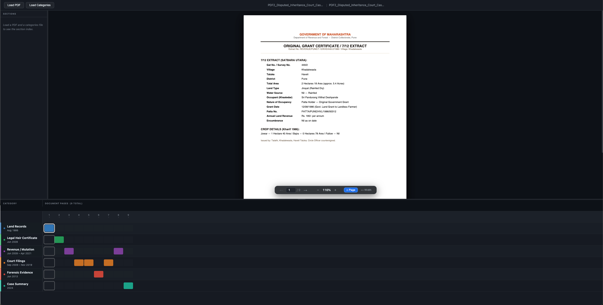
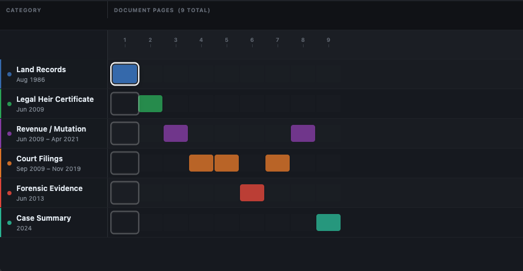
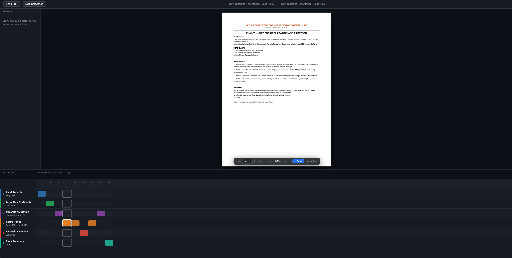
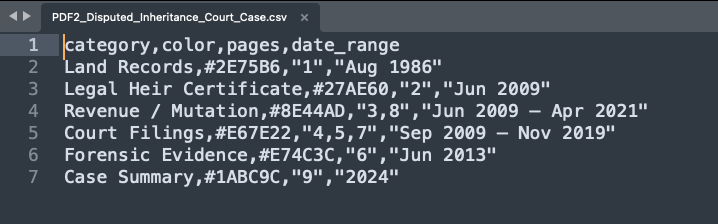

# PDF Timeline Viewer

A browser-based tool that overlays a **swimlane timeline** onto any multi-page PDF. Each swimlane represents a category of pages (e.g. a legal topic, a document section, a project phase). Clicking a block in the timeline jumps the PDF to that page instantly.

No installation, no server, no data leaves your machine — everything runs locally in your browser.

---

## Screenshots

**Homepage — load a PDF and categories file to get started**


**Timeline View — swimlane overview of all categories across pages**


**Page Navigation — click any block or use arrow keys to jump to a page**


**CSV File Example — the categories file format**


---

## Features

- **Swimlane timeline** — one row per category, coloured blocks for matching pages
- **Click any block** to jump to that page in the PDF
- **Active page highlight** — current page is outlined across all swimlanes
- **Resize panels** — drag the horizontal bar to adjust timeline height; drag the sidebar edge to adjust its width
- **Zoom controls** — fit-page, fit-width, zoom in/out, keyboard shortcuts
- **Keyboard navigation** — `←` / `→` arrow keys, `Home`, `End`
- **Drag & drop** — drop a PDF or CSV/Excel file anywhere on the window
- **Date ranges** — shown under each category label if provided in the data file
- **No dependencies to install** — all libraries are bundled in `lib/`

---

## Quick Start

### 1. Open the app

**Option A — double-click** `index.html` (works in most browsers for local files).

**Option B — local server** (recommended, avoids browser file-access restrictions):

```bash
# Python (built-in)
python3 -m http.server 8765
# then open http://localhost:8765

# Node.js (npx, no install needed)
npx serve .
```

### 2. Load a PDF

Click **Load PDF** in the toolbar, or drag and drop a `.pdf` file anywhere on the window.

### 3. Load a categories file

Click **Load Categories** and choose a `.csv` or `.xlsx` / `.xls` file.

The timeline renders automatically once both files are loaded.

---

## Categories File Format

> **New to this?** See the [CSV Builder Guide](CSV_GUIDE.md) for a step-by-step walkthrough, a named colour palette you can pick from, and a copy-paste template.

The categories file tells the app which pages belong to which group and what colour to use.

### Required columns

| Column | Description | Example |
|--------|-------------|---------|
| `category` | Label shown in the swimlane | `Court Filings` |
| `color` | Hex colour for this lane | `#E67E22` |
| `pages` | Comma-separated page numbers or ranges | `4,5,7` or `10-20` or `1,3,10-15,22` |

### Optional column

| Column | Description | Example |
|--------|-------------|---------|
| `date_range` | Date label shown under the category name | `Sep 2009 – Nov 2019` |

### CSV example

```csv
category,color,pages,date_range
Land Records,#2E75B6,"1","Aug 1986"
Legal Heir Certificate,#27AE60,"2","Jun 2009"
Revenue / Mutation,#8E44AD,"3,8","Jun 2009 – Apr 2021"
Court Filings,#E67E22,"4,5,7","Sep 2009 – Nov 2019"
Forensic Evidence,#E74C3C,"6","Jun 2013"
Case Summary,#1ABC9C,"9","2024"
```

> **Tip:** Pages not covered by any category appear as dim grey blocks — useful for spotting uncategorised pages at a glance.

### Excel (.xlsx) example

Use the same column names as headers in row 1. Pages with commas (e.g. `4,5,7`) should be in a single cell.

---

## Sample Files

The `sample/` folder contains two ready-to-use examples:

| File | Description |
|------|-------------|
| `sample/sample.pdf` | Generic 60-page document |
| `sample/sample.csv` | 6 categories (Introduction, Background, Methodology, Results, Discussion, Appendix) |
| `sample/PDF2_Disputed_Inheritance_Court_Case.pdf` | 9-page legal court case document |
| `sample/PDF2_Disputed_Inheritance_Court_Case.csv` | 6 legal categories (Land Records, Legal Heir Certificate, Revenue/Mutation, Court Filings, Forensic Evidence, Case Summary) |

---

## Keyboard Shortcuts

| Key | Action |
|-----|--------|
| `←` / `↑` | Previous page |
| `→` / `↓` | Next page |
| `Home` | First page |
| `End` | Last page |
| `Ctrl` + `+` | Zoom in |
| `Ctrl` + `-` | Zoom out |
| `Ctrl` + `0` | Fit page |

---

## Project Structure

```
pdf-timeline-viewer/
├── index.html          # App shell — layout and script tags
├── style.css           # All styles (dark theme, swimlane, PDF panel)
├── app.js              # State, file loading, navigation, resize handles
├── parser.js           # CSV / Excel → normalised categories array
├── pdf-viewer.js       # PDF.js wrapper (render, zoom, preload)
├── timeline.js         # Swimlane DOM builder and active-page sync
├── lib/
│   ├── pdf.min.js          # PDF.js (Mozilla)
│   ├── pdf.worker.min.js   # PDF.js worker
│   ├── papaparse.min.js    # CSV parser
│   └── xlsx.full.min.js    # Excel parser
└── sample/
    ├── sample.pdf
    ├── sample.csv
    ├── PDF2_Disputed_Inheritance_Court_Case.pdf
    └── PDF2_Disputed_Inheritance_Court_Case.csv
```

---

## Browser Support

Works in any modern browser: Chrome, Firefox, Safari, Edge (2020+).

> Password-protected PDFs are not supported.

---

## Privacy

All processing happens in your browser. No files, no page content, and no metadata are ever uploaded or transmitted anywhere.

---

## License

MIT — free to use, modify, and distribute.
